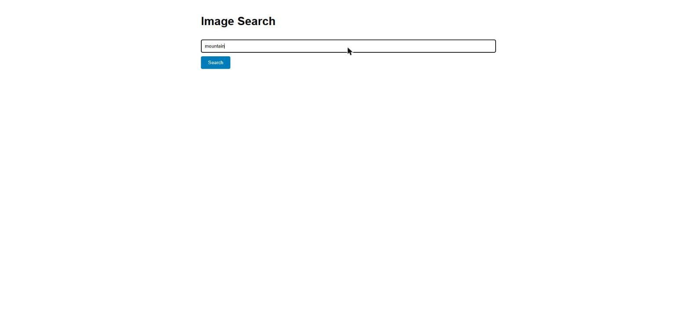
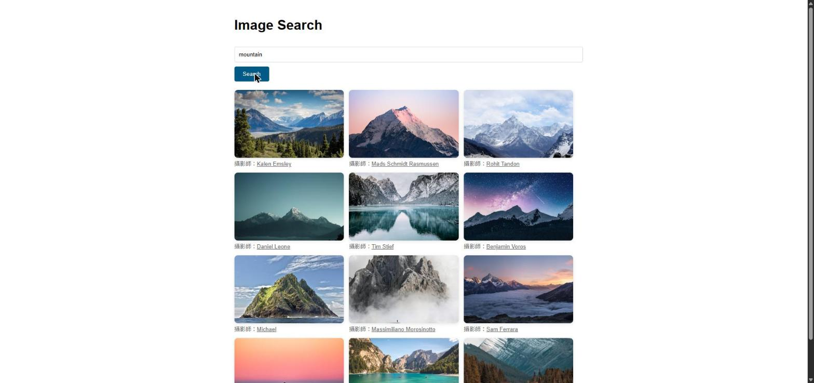

# Image Search

輸入關鍵字搜尋圖片的小網站，前端串接一個輕量 Python 後端，後端再呼叫 [Unsplash API](https://unsplash.com/developers) 取得搜尋結果。另外有一個 AI 聊天欄位，目前固定回覆「AI 尚未線上」。

## 專案結構

```
/
├── index.html          前端頁面（含圖片搜尋 + AI 聊天）
├── run.py               啟動伺服器的進入點
└── api/
    ├── config.py.example  Unsplash Access Key 設定範本
    └── handler.py          路由處理：/api/search、/api/chat
```

## 使用前準備

1. 到 [unsplash.com/developers](https://unsplash.com/developers) 申請一組 **Access Key**
2. 複製 `api/config.py.example` 為 `api/config.py`
3. 把 Key 填入 `api/config.py`：
   ```python
   UNSPLASH_ACCESS_KEY = '你的Access_Key'
   ```

`api/config.py` 已加入 `.gitignore`，不會被提交，Key 不會外流。

## 啟動方式

```
python run.py
```

啟動後開啟 http://localhost:8000

## 使用範例

1. 開啟網頁，會看到搜尋框和 Search 按鈕

   

2. 在搜尋框輸入關鍵字（例如 `mountain`）

   

3. 按下 Search，稍等一下就會顯示搜尋結果，每張圖下方附有攝影師署名連結

   

## 技術細節

後端只用 Python 標準庫（`http.server`、`urllib`），不需要另外安裝套件。AI 聊天欄位目前是預留功能，尚未串接真正的 AI 服務。
